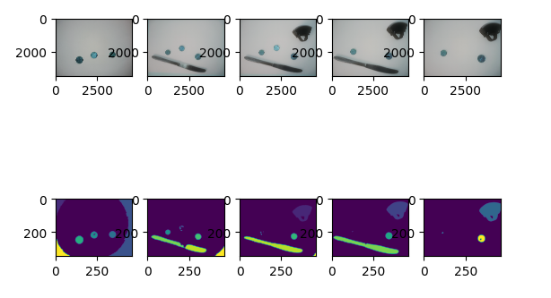

+++
title = "RC 2022 week 8 days 2 & 3 - images to sound"
date = 2022-09-28
+++

I spent today and yesterday working on turning images into sounds.  I'd ultimately like to make a programmable environment sound make, when I have all the hardware I need.

I used Python, which has a lot of cool libraries for both image and sound processing.  And [this](https://towardsdatascience.com/music-in-python-2f054deb41f4) article helped me a lot.

## step one: processing photos

First, I processed the photo with Connected Component Analysis.  These are some photos before and after the analysis:

  

## step 2: generating sound

Then I mapped different attributes of each blob in the processed image to different components of a sound.  For example, the blob area maps to the frequency.

This is my first attempt - here the frequency is based purely on the area.  different.  It's quite unpleasant to listen to:

<audio controls src="untuned.mp3" alt="Very dissonant sounds"></audio>

I then added some tuning - ranges of frequencies get mapped to a single (in tune) frequency.  It sounds slightly better:

<audio controls src="tuned.mp3" alt="Slightly less dissonant sounds."></audio>

## next steps

I'm not sure where I'll go next with this project, here are some of the things I'm thinking about:

- What is the most intuitive mapping of image component attributes to sounds?  I'm especially thinking about what would be intuitive if/when this becomes a hardware project.

- How much do I want to tune vs have the sounds be raw representations of the image?  Do I even want to try to make this sound good?

- What other aspects of the sounds could I change to improve or alter the sounds?  I don't know much about sound or music theory, so this is pretty open ended

-----
## update 2022-09-30:

I experimented a bit with different amplitudes and phrase length & repetition.  I think this sounds a bit more interesting:

<audio controls src="v3.mp3" alt="This sounds like a modem struggling to connect to the internet."></audio>

<audio controls src="v4.mp3" alt="This sounds like angry bots in a low budget sci fi movie."></audio>

The code is [here](https://github.com/nsreeen/image2sound).
